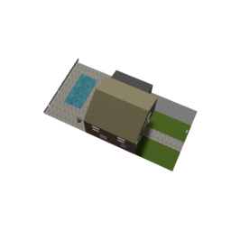
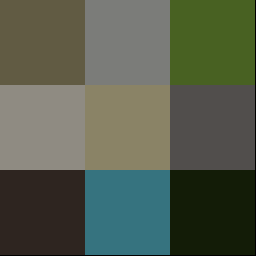
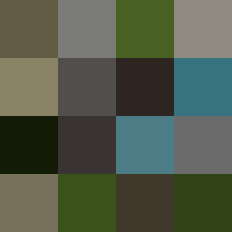

# image2palette

This project is used for translate 1 image to its
own palette.

The core code for extracting image color is done by [extcolors python library](https://github.com/CairX/extract-colors-py).

## Examples:
Given this image as input:



We can get output like this (3x3 grid):




and this (4x4 grid):



Please note the 3x3 grid result has some black residues at the bottom, this is because the input image size 256 is not divisible by 3.

## How to use
just type:

```
python image2palette.py [input_path] [output_path] [tolerance] [limit]
```

The `input_path` is the input image file path; the `output_path` is the output palette saving path.

There are default values for `tolerance` and `limit`, but you can also change to the value you want. 

The `tolerance` is one parameter for extcolors [extcolors python library](https://github.com/CairX/extract-colors-py), sometimes a large tolerance will end up with insufficient number of color so I will decrement the value of tolerance if this happens; The `limit` is the total number of extracted color also decides the output grid size and should be a number of squares plus 1 (like 9(3x3)+1=10, 16(4x4)+1, and so on) for a good output palette.

## TODO:
The color patches in the output palette is arranged in the order of its own proportion currently, and I will try to change the size of different color patches so that the color with a larger proportion will have a larger area in the future.
